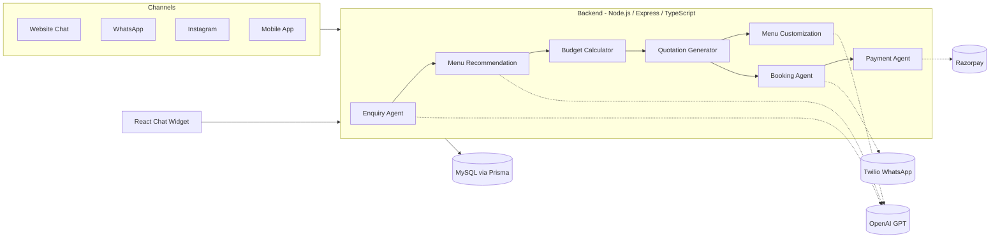

# CateringAI

An AI-powered catering agent platform that automates the customer journey from first
enquiry to final payment: **Enquiry → Menu Recommendation → Budgeting → Quotation →
Customization → Booking → Payment**.

## Architecture



## Event lifecycle (Enquiry stage machine)

`ENQUIRY → QUOTATION → NEGOTIATION → CONFIRMED → PREPARATION → COMPLETED` (or `CANCELLED`
at any point). See `EventStage` enum in [backend/prisma/schema.prisma](backend/prisma/schema.prisma).

## Modules

| # | Feature | Backend module |
|---|---------|----------------|
| 1 | Customer Enquiry Agent | `backend/src/modules/enquiry` |
| 2 | AI Menu Recommendation | `backend/src/modules/menu` |
| 3 | AI Budget & Cost Calculator | `backend/src/modules/budget` |
| 4 | AI Quotation Generator (PDF) | `backend/src/modules/quotation` |
| 5 | Smart Menu Customization | `backend/src/modules/customization` |
| 6 | Event Booking Agent | `backend/src/modules/booking` |
| 7 | Payment Agent | `backend/src/modules/payment` |
| — | WhatsApp channel webhook | `backend/src/modules/whatsapp` |
| — | Admin: categories, items, pricing tiers | `backend/src/modules/category` |

Each module follows the same pattern: `*.routes.ts` → `*.controller.ts` → `*.service.ts`
(+ `*.ai.ts` for modules that call OpenAI).

## Data model

MySQL schema (via Prisma) covers: `Customer`, `Enquiry`, `MenuCategory` + `CategoryPricingTier`
(admin-managed catalog & tentative pricing), `MenuItem`, `MenuPackage` + `MenuPackageItem`
(AI-generated packages), `Quotation`, `Booking`, `Payment`.
See [backend/prisma/schema.prisma](backend/prisma/schema.prisma).

### Menu catalog

Seeded via `npm run prisma:seed` with 16 categories (Soup, Mocktail, Starters, Salad Bar,
Juice Bar, Thai/Singaporean/Sri Lankan Cuisine, Main Course, Breads, Rice, Dal, Desserts,
Beverages, Live Counter, Kids Menu) and 200+ dummy items. Each category also has a
`CategoryPricingTier` per guest count band (`FIFTY`, `HUNDRED`) with a min/max per-person price,
used to give customers a tentative budget range before the full AI menu is generated.

## API overview

- `POST /api/enquiries/message` — chat turn; extracts/updates the structured Event Requirement.
- `POST /api/enquiries/wizard` — structured planning wizard submission (event type, guest/pax
  count, date, venue type, budget, meal times) — no AI parsing needed.
- `POST /api/menu/estimate` — tentative min/max price per person for a set of categories + guest
  count (uses `CategoryPricingTier`).
- `POST /api/menu/enquiries/:enquiryId/generate` — AI generates 2-3 menu packages.
- `POST /api/menu/packages/:id/select` — customer selects a package.
- `POST /api/budget/calculate` — recompute cost breakdown for any guest count/rates.
- `POST /api/quotations` — build quotation (uses budget calculator) + generate PDF.
- `POST /api/customization/packages/:menuPackageId` — natural-language menu edits (e.g.
  "remove Paneer Tikka, add Dahi Puri", "no onion and garlic").
- `POST /api/bookings/confirm` — creates a Booking + Event ID, moves stage to `CONFIRMED`.
- `PATCH /api/bookings/:id/stage` — move booking through `PREPARATION` → `COMPLETED`.
- `POST /api/payments/initiate` / `POST /api/payments/confirm` — Razorpay advance/balance
  payment flow; auto WhatsApp confirmation + daily reminder cron for outstanding balances.
- `POST /api/whatsapp/webhook` — Twilio inbound WhatsApp webhook, routes to the Enquiry Agent.

The planning wizard creates the customer and enquiry before generating menu packages, then
provides a WhatsApp deep link with a prefilled welcome message. This does not send messages
server-side; the customer confirms and sends the message from WhatsApp.

### Admin (category / item / pricing management)

- `GET/POST /api/admin/categories` — list/create menu categories.
- `GET/PATCH/DELETE /api/admin/categories/:id` — manage a category.
- `GET/POST /api/admin/categories/:id/items` — list/add menu items within a category.
- `PATCH/DELETE /api/admin/categories/items/:itemId` — update/remove a menu item.
- `GET/PUT /api/admin/categories/:id/pricing` — list/upsert `FIFTY`/`HUNDRED` pax pricing tiers.
- `GET /api/admin/categories/pricing` — pricing tiers for every category (admin overview).

## Setup

### Prerequisites
- Node.js 18+
- MySQL 8+
- OpenAI API key
- (optional) Twilio WhatsApp sandbox/number, Razorpay test keys

### Backend

```powershell
cd backend
copy .env.example .env   # fill in DATABASE_URL, OPENAI_API_KEY, Twilio, Razorpay
npm install
npm run prisma:generate
npm run prisma:migrate
npm run prisma:seed      # loads a starter menu catalog (Gujarati/Punjabi items)
npm run dev              # http://localhost:4000
```

### Frontend

```powershell
cd frontend
npm install
npm run dev               # http://localhost:5173
```

The frontend dev server proxies `/api` and `/quotations` to the backend on port 4000.

### Deploying frontend and backend separately

When the frontend is deployed to Vercel and the backend to Render, set this Vercel
environment variable for the `frontend` project before building:

```text
VITE_API_BASE_URL=https://<your-render-service>.onrender.com/api
```

The frontend uses `/api` when this variable is not set, which is suitable for the local
Vite proxy but does not reach a separately deployed Render service.

### WhatsApp

Point your Twilio WhatsApp sandbox/number webhook to:
`POST https://<your-domain>/api/whatsapp/webhook`

## Notes / next steps

- Instagram and native mobile app channels can reuse the same `enquiry.service.ts` entry point
  (`handleEnquiryMessage`) — only a channel-specific webhook/controller needs to be added, same as
  the WhatsApp module.
- Payment receipts currently return a placeholder URL; wire up real PDF receipt generation
  (reuse `quotation.pdf.ts` pattern) before production use.
- Add authentication/authorization (staff dashboard vs. public customer endpoints) before deploying.
